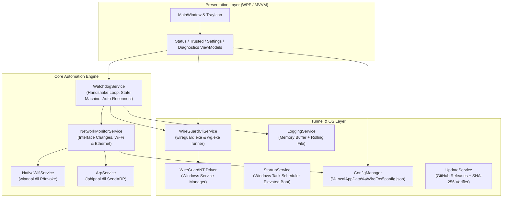

# WireFox Architectural Blueprint & Reference Manual

> **Purpose for AI Pair Programmers & Developers**:
> Read this document first before inspecting large `.cs` source files. It defines the core data pipeline, service contracts, threading models, and critical invariants across the entire WireFox codebase.

---

## 1. High-Level Subsystem Architecture

---

## 2. Subsystem Directory & API Matrix

### Core Services (`Services/`)

| Service | File Size | Key Responsibilities | Primary Methods / Events | Invariants & Gotchas |
| :--- | :--- | :--- | :--- | :--- |
| **`WireGuardCliService`** | ~41 KB | Discovers `wireguard.exe` / `wg.exe`, installs/uninstalls Windows tunnel services, queries `wg show <tunnel> dump`. | • `GetInstalledTunnels()` • `InstallTunnelService(confPath)` • `UninstallTunnelService(tunnelName)` • `GetTunnelRuntimeStats(tunnelName)` • `IsServiceRunning(tunnelName)` | Requires Administrator elevation. Tunnel services register as `WireGuardTunnel$<name>`. When parsing `wg show dump`, timestamps are Unix epochs. |
| **`WatchdogService`** | ~32 KB | Active background loop (default: 5s timer). Evaluates network trust vs tunnel state, monitors handshake latency, executes 15-minute temporary pause/snooze. | • `StartWatchdog()` / `StopWatchdog()` • `EvaluateNetworkState(NetworkState)` • `PauseProtection(TimeSpan)` • `ResumeProtection()` • Event: `TunnelStateChanged` • Event: `WatchdogStatusChanged` | **Threading**: Runs on background timer. Any event modifying UI properties must marshal to `App.Current.Dispatcher`. Never block the watchdog loop with modal dialogs. |
| **`NetworkMonitorService`** | ~21 KB | Listens to `NetworkChange` events, debounces network flappings (2-3 sec settle window), queries Wi-Fi SSID and Gateway MAC. | • `StartMonitoring()` • `GetCurrentNetworkState()` • `EvaluateIsTrusted(NetworkState)` • Event: `NetworkChanged` | Network transitions on Windows can fire dozens of rapid-fire events; monitor uses a debounce timer before signaling a state change to avoid tunnel thrashing. |
| **`NativeWifiService`** | ~8 KB | Queries Wi-Fi connection info via native Windows `wlanapi.dll`. | • `GetCurrentConnectedSsid()` • `GetConnectedBssid()` | P/Invoke layer. Returns empty string when connected via Ethernet or if Wi-Fi adapter is powered down. |
| **`ArpService`** | ~1.6 KB | Physical gateway hardware identification via unmanaged `iphlpapi.dll SendARP`. | • `GetGatewayMacAddress(IPAddress gatewayIp)` | Sends an ARP packet to resolve IPv4 gateway MAC. Returns normalized colon-delimited MAC (`AA:BB:CC:DD:EE:FF`). Essential for anti-spoofing. |
| **`ConfigManager`** | ~19 KB | Serialization and persistence of `AppConfig` to `%LocalAppData%\WireFox\config.json`. | • `LoadConfig()` • `SaveConfig()` • `AddTrustedNetwork(ssid)` • `AddTrustedGateway(mac, ip)` | Uses lock on read/write to prevent race conditions. Automatically migrates schema versions if new fields are added. |
| **`StartupService`** | ~18 KB | Manages elevated startup without UAC prompts using Windows Scheduled Tasks (`schtasks.exe`). | • `IsStartupEnabled()` • `SetStartup(bool enable)` • `RegisterScheduledTask()` | Creates scheduled task with `HighestAvailable` run level triggered at user logon. Fallback to `HKCU\Software\Microsoft\Windows\CurrentVersion\Run` if Task Scheduler fails. |
| **`UpdateService`** | ~22 KB | Checks GitHub Releases API for latest tag, downloads asset, computes local SHA-256 hash. | • `CheckForUpdatesAsync()` • `VerifyFileHash(filePath, expectedHash)` • `ComputeLocalExecutableSha256()` | Compares local running binary hash against remote `SHA256SUMS.txt`. Non-blocking async HTTP. |
| **`NotificationService`**| ~9 KB | Windows native Action Center Toast notifications with action buttons. | • `ShowToast(title, message, icon)` • `ShowActionToast(title, msg, actions)` | Respects Windows "Focus Assist / Do Not Disturb" mode. |
| **`LoggingService`** | ~4.8 KB | Thread-safe in-memory rolling log buffer for `DiagnosticsPage` plus rolling file output. | • `LogInfo(msg)` • `LogWarning(msg)` • `LogError(msg, ex)` • `GetRecentLogs()` | Thread-safe circular buffer capped at 1,000 entries to prevent memory growth. |

---

## 3. Data & State Models (`Models/`)

- **`AppConfig`**:
  - `Version`: Config schema version.
  - `SelectedTunnel`: Active tunnel configuration name (e.g. `wg0`).
  - `TrustedNetworks`: List of trusted Wi-Fi SSIDs and domain suffixes.
  - `TrustedGateways`: List of `TrustedGateway` objects (IP + MAC + Profile name).
  - `HandshakeTimeoutSeconds`: Maximum age before tunnel is declared stalled (default: 180s).
  - `AutoRecoverFreeze`: Automatically bounce tunnel service if driver lockup detected.
  - `StartMinimized`: Silent tray launch.
  - `StartWithWindows`: Scheduled task toggle.
- **`NetworkState`**:
  - `IsConnected`: Boolean internet availability.
  - `IsWifi`: True if 802.11 wireless, false if Ethernet/cellular.
  - `Ssid`: Active Wi-Fi network name.
  - `GatewayIp`: IPv4 default gateway.
  - `GatewayMac`: Hardware MAC address resolved via ARP.
  - `IsTrusted`: Evaluated trust verdict.
- **`TunnelStatus` Enum**:
  - `Disconnected`: Tunnel service not installed / stopped.
  - `Connected`: Tunnel active and routing traffic.
  - `Bypassed`: Tunnel disconnected because user is on a Trusted Network.
  - `Paused`: Temporary session active (e.g. 15-min snooze).
  - `Stalled`: Active tunnel with handshake timeout / packet drop detected.

---

## 4. Presentation & MVVM Layer (`ViewModels/` & `Views/`)

| Page / View | ViewModel | Responsibilities |
| :--- | :--- | :--- |
| **`MainWindow`** | `MainViewModel` | App shell, navigation sidebar (Status, Trusted Networks, Diagnostics, Settings), System Tray icon and tray context menu. |
| **`StatusPage`** | `StatusViewModel` | Big status banner (Connected / Bypassed / Paused), active network summary, last handshake age, quick actions: "Pause 15 Mins", "Split-Tunnel", "Untrust Network". |
| **`TrustedNetworksPage`** | `TrustedNetworksViewModel` | List of trusted SSIDs and hardware gateways. "Fill Detected Info" button for 1-click gateway addition. |
| **`DiagnosticsPage`** | `DiagnosticsViewModel` | Subsystem health checks (WireGuard executables present, driver registered), live searchable log console, "Run Diagnostic Scan" button. |
| **`SettingsPage`** | `SettingsViewModel` | Tunnel selection combo box, handshake timeout slider, AllowedIPs configuration, theme selection, scheduled boot startup toggle, check for updates button, uninstall button. |

---

## 5. Critical Invariants & Rules

1. **Elevation Requirement**:
   - `WireFox.exe` requires Windows Administrator elevation (`app.manifest` has `requireAdministrator`) because starting/stopping the WireGuardNT driver and issuing unmanaged `SendARP` calls cannot be performed standard.
2. **Never Block the UI Thread**:
   - Spawning `wireguard.exe` or `wg.exe` must always use `ProcessStartInfo` with async output redirection or run on background worker threads.
   - Any background task updating ViewModel properties bound to the UI must use `Application.Current.Dispatcher.InvokeAsync(...)`.
3. **Network Change Debouncing**:
   - When Windows connects to Wi-Fi, it fires multiple state changes as IP, DNS, and default route are assigned. Always allow the 2–3 second settling timer before taking destructive tunnel actions.
4. **Clean Process Exits**:
   - On application exit, if a temporary session is paused, verify user preference before leaving tunnel down or up.
   - Mutex `WireFox_SingleInstance_Mutex` must be released in `App.OnExit()`.
