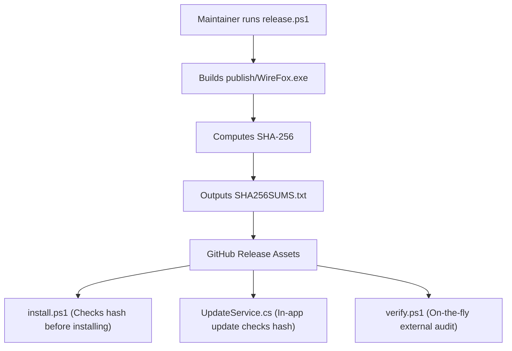

# WireFox Release Guide & Integrity Workflow

> [!IMPORTANT]
> **🤖 ATTENTION AI ASSISTANTS & MAINTAINERS: READ THIS BEFORE RELEASING**
> WireFox uses a strict **SHA-256 cryptographic trust model**. All installer scripts (`install.ps1`), in-app self-updaters (`UpdateService.cs`), and external auditors (`verify.ps1`) verify that the downloaded executable matches the cryptographic hash published on GitHub.
>
> If you upload a binary without its matching `SHA256SUMS.txt` or if you re-compile the executable after creating the release, **users will receive a CHECKSUM MISMATCH warning and updates will abort.**
>
> **Always use the automated release script or follow this checklist to the letter.**

---

## ⚡ The Automated Way (Recommended)

Run the release script in PowerShell, providing the desired version:

```powershell
.\release.ps1 -Version "1.1.0"
```

### What this script does automatically:
1. Updates `<Version>1.1.0</Version>` in `WireFox.csproj`.
2. Compiles the single-file self-contained release: `publish\WireFox.exe`.
3. Computes the SHA-256 hash.
4. Generates `publish\SHA256SUMS.txt` and `publish\WireFox.exe.sha256`.
5. Commits `WireFox.csproj` and creates a Git tag: `git tag v1.1.0`.
6. Prints the exact markdown table to copy/paste into your GitHub Release notes.

---

## 📦 Publishing the GitHub Release

After running `release.ps1`:

### 1. Push Commits and Tags
```powershell
git push origin HEAD --tags
```

### 2. Create the GitHub Release
1. Navigate to: `https://github.com/TalviFox/WireFox/releases/new`
2. Select the tag you just created (e.g., `v1.1.0`).
3. Set the Release Title: `WireFox v1.1.0`.
4. Paste the checksum block generated by `release.ps1`:
   ```markdown
   ## 🔒 Checksums & Binary Verification
   | File | SHA-256 Checksum |
   | :--- | :--- |
   | **WireFox.exe** | `<hash-printed-by-release.ps1>` |

   Verify integrity before running (PowerShell):
   ```powershell
   irm https://raw.githubusercontent.com/TalviFox/WireFox/main/verify.ps1 | iex
   ```
   ```
5. **CRITICAL: Attach the following 2 files from `publish/` as release assets:**
   - `publish\WireFox.exe`
   - `publish\SHA256SUMS.txt`
6. Click **Publish release**.

---

## 🛠️ Manual Release Steps (Fallback)

If `release.ps1` cannot be run for any reason, follow these exact manual steps:

1. **Bump Version:**
   In [WireFox.csproj](file:///WireFox.csproj), edit:
   ```xml
   <Version>1.1.0</Version>
   ```

2. **Build Single-File Executable:**
   ```powershell
   dotnet publish WireFox.csproj -c Release -r win-x64 --self-contained true -p:PublishSingleFile=true -o publish/
   ```

3. **Compute SHA-256 Hash:**
   ```powershell
   $hash = (Get-FileHash publish\WireFox.exe -Algorithm SHA256).Hash.ToLowerInvariant()
   Set-Content -Path publish\SHA256SUMS.txt -Value "$hash  WireFox.exe"
   Write-Host "SHA-256: $hash"
   ```

4. **Commit and Tag:**
   ```powershell
   git commit -am "Release v1.1.0"
   git tag -a "v1.1.0" -m "WireFox Release v1.1.0"
   git push origin HEAD --tags
   ```

5. **Upload Assets to GitHub:**
   Upload both `publish\WireFox.exe` and `publish\SHA256SUMS.txt` to the release.

---

## 🔍 How the Integrity Chain Works



### Verification Endpoints
* **Installer:** `irm https://raw.githubusercontent.com/TalviFox/WireFox/main/install.ps1 | iex`
* **Auditor:** `irm https://raw.githubusercontent.com/TalviFox/WireFox/main/verify.ps1 | iex`
* **Uninstaller:** `irm https://raw.githubusercontent.com/TalviFox/WireFox/main/uninstall.ps1 | iex`
* **In-App:** Settings > Updates & Binary Integrity > Click **Check for Updates** or **External Hash Audit**
